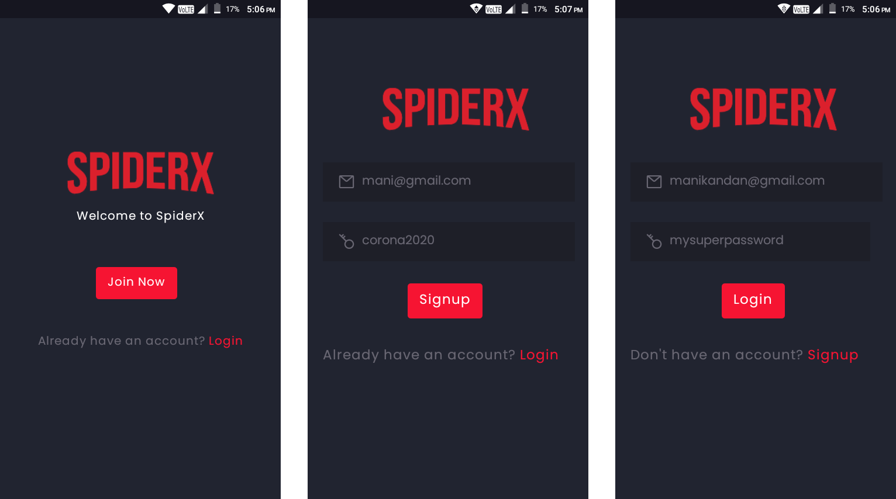
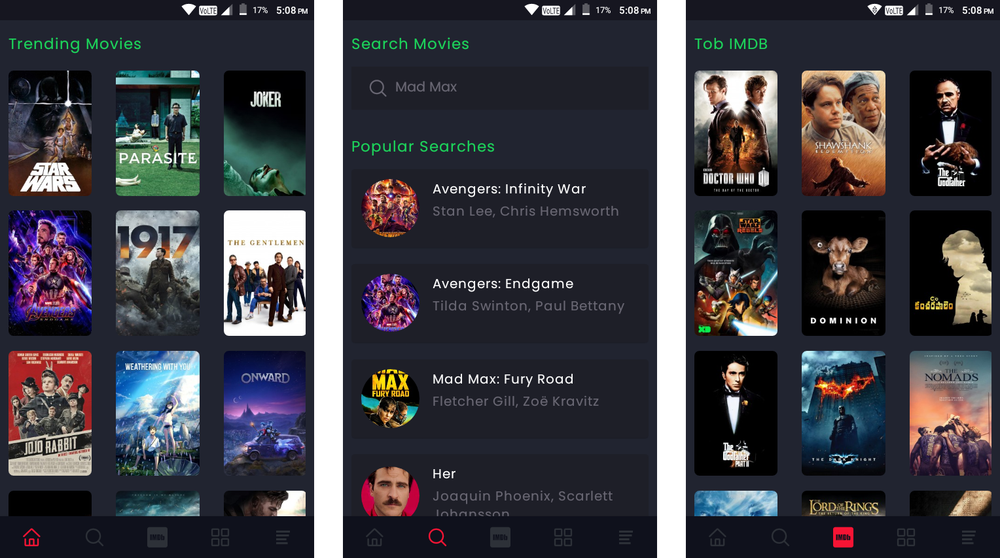

# SpiderX Native

SpiderX allows you to stream movies by scraping links available on the internet using the python scrapy framework. 

Note: I made this project to learn react native, web scraping and a new frontend framework (in this case, vuejs). I will not use this to stream pirated movies or distribute the apks to anyone.

# How It Works

1. The user searches will be first sent to firestore, if those searches are not present in firestore then the python scraper will be called.
2. Once the scraper scrapes the data, the scraped data will be sent to firstore.
3. The app uses firebase real-time updates to update the UI.

# UI

## Authentication



## Home, Search, Imdb



## Favorites, Search Result, Movie Info


# Running Locally

This app is built with expo, so you need to install the expo cli package globally in your system.

```bash
npm i -g expo-cli
```

You also need to setup a firebase project and the url to your python scraper (I am using heroku for hosting the scraper)

Create a .env file at the root of the project that looks like this:

```bash
# the url to your python scraper
SPIDERX_HEROKU=<YOUR_URL_HERE>

# firebase web configuration (you need to first create a firebase project)
APIKEY=<APIKEY_HERE>
AUTHDOMAIN=<AUTHDOMAIN_HERE>
DATABASEURL=<DATABASEURL_HERE>
PROJECTID=<PROJECTID_HERE>
STORAGEBUCKET=<STORAGEBUCKET_HERE>
MESSAGESENDERID=<MESSAGESENDERID_HERE>
APPID=<APPID_HERE>
MEASUREMENTID=<MEASUREMENTID_HERE>
```

Then clone this repo, install the dependencies and run <code>expo start</code>

```bash
git clone https://github.com/manikandanraji/spiderx-native
cd spiderx-native
npm i
expo start
```

# Web

I also built a web interface using vuejs, if you are interested [here's the repo](https://github.com/manikandanraji/spiderx-frontend)
